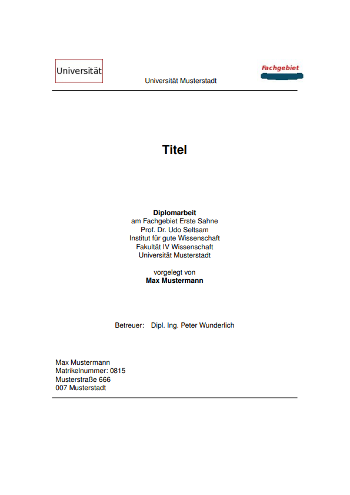

diplomarbeit-vorlage-latex
==========================

Vorlage zur Erstellung von Diplom-/Master-/Bachelor-Arbeiten mit dem Textsatzsystem LaTeX

### Struktur
<pre>
----bilder/	-> Verzeichnis, indem die Bilder liegen, die mit \includegraphics eingebunden werden können
  |
  --extras/	-> Verzeichnis, indem verschiedene Sonderdateien, wie Titelblatt oder Definitionsheader liegen
  |
  --kapitel/	-> Verzeichnis, indem nun der eigentliche Inhalt steht - ausbaubar :-)
  |
  --literatur/	-> Verzeichnis, indem Literaturdateien im BibTeX Format liegen
  |
  --diplom.tex	-> Die Hauptdatei
</pre>
*extras/header.tex* enthält sämtliche Formatierungen. Diese können dort nach Belieben verändert werden.

*extras/titelseite.tex* beschreibt die Titelseite. Auch hier sind Variablen, die mit individuellen Einträgen versehen werden müssen.

*diplom.tex* fasst alle einzelnen Dateien zusammen und bildet das Hauptdokument.

Der Rest spricht hoffentlich für sich.

### Um nun die Arbeit zu erstellen, folgendes ausführen

1. $ pdflatex diplom.tex -output-format=pdf 
	* Erste Erstellung von Verzeichnissen und Dateien mit Verweisen, vor allem die "diplom.aux" Datei 
2. $ bibtex diplom.aux		
	* Erstellen des Literaturverzeichnisses
3. $ makeindex diplom.nlo -s nomencl.ist -o diplom.nls 
	* Erstellen des Abkürzungsverzeichnisses
4. $ pdflatex diplom.tex -output-format=pdf		
	* Erstellen des Inhaltsverzeichnisses
5. $ pdflatex diplom.tex -output-format=pdf
	* Einbinden des Inhaltsverzeichnisses

**NEU:** Einfach die build.sh ausführen, wenn eine unix-shell vorhanden ist.

Nun kann man sich die Datei "diplom.pdf" mit einem Viewer seiner Wahl anschauen.

### Beispiel

Hier könnt ihr auch ein Beispiel ansehen:

Viel Spaß! 
